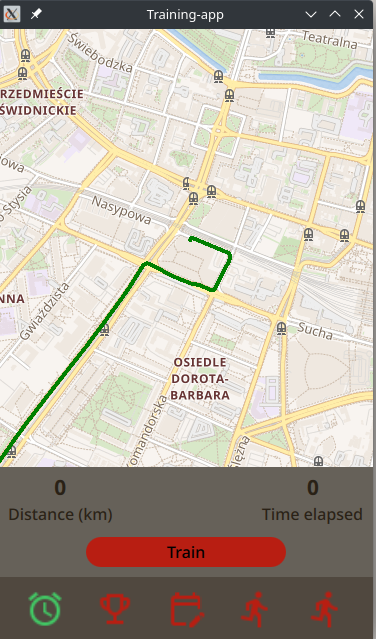
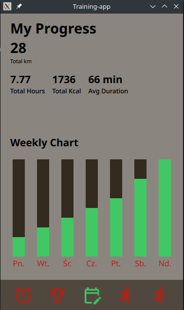
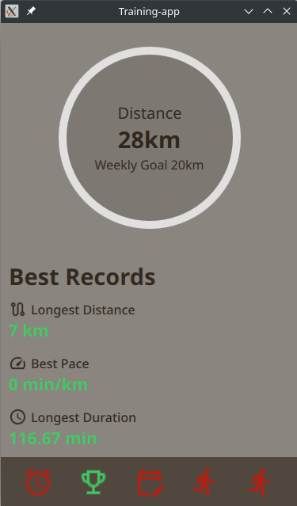

# Training-App-Qt

This is a multiplatform Running app build with MVVM pattern

Technology stack:

1. C++ - backend
2. Qt Quick - app GUI
3. Mapbox/OpenStreetView - creating a map, getting GPS data, drawing routes, getting data from routes such as distance and so on
4. SQLite - local database
5. Android SDK - deployment on mobile
6. GTest - testing
7. CMake - build automation

Running App:

In SETUP.md there is a tutorial how to set it up

Clean->Run CMake->Build->Compile (sometimes just compile doesn't work, so you have to click build first)

Running Tests:

For now, just comment out the main and uncomment catch_main.cpp, then "cmake .. && make -j16 && ./Training_App

In the future there will be a cmake flag for this to change from testing to normal

TODO:
1. Email Authentication via Firebase - retest and fix
2. Database on Firebase - retest and fix if necessary, change from name@gmail.com -> name as parameter to name-gmail as parameter
3. Add async where it's needed
4. Add Design Patterns 
5. Add CI/CD
6. Clean up structure, so header to header folder

Testing:
1. Test all database functions: adding, checking databases, also after killing app, add pretty function to every fail to this database
2. Recheck if all clickable stuff works, also if it gives proper values to database, use __PRETTY_FUNCTION__
3. Recheck why so many warnings from database and map
4. Check if logging in and registing actually works
5. Test if map actually tracks data and puts in everywhere else all those maxes and so on

Warnings:
1. QSqlDatabasePrivate::addDatabase: duplicate connection name 'qt_sql_default_connection', old connection removed.
Database: connection ok
2. ERROR:  void DataBase::createTable() "No query Unable to fetch row"

Commit c2945c71274c5eafb9bae044a8eb4130bf1aae9a is last one working on desktop and android and has no firebase, this should be fixed with a flag, or design pattern

